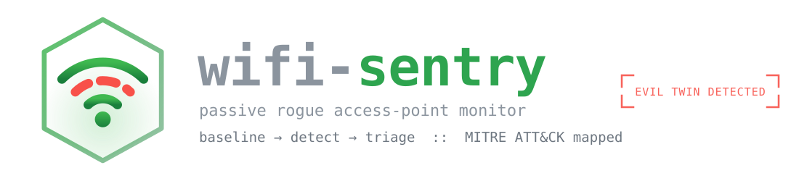
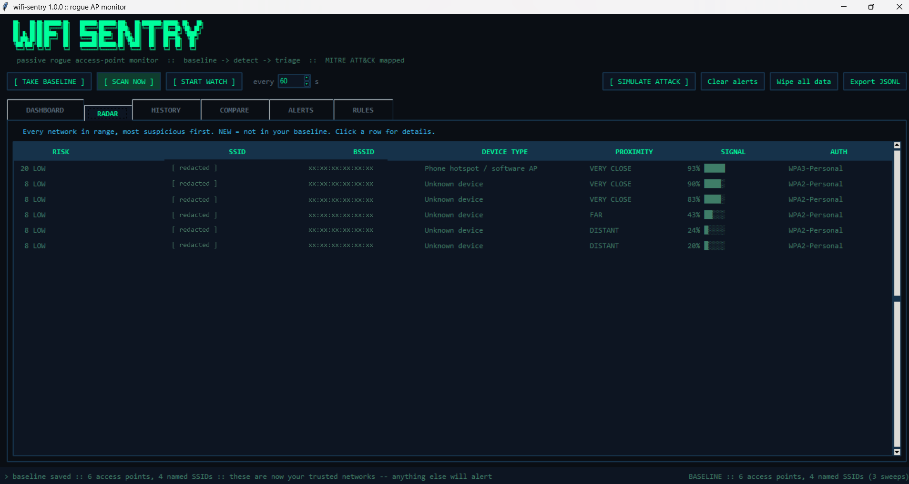
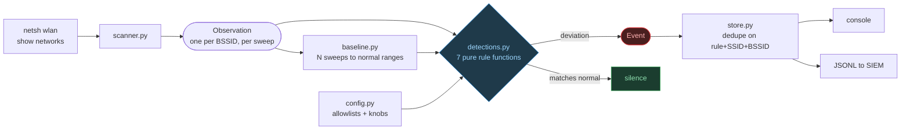
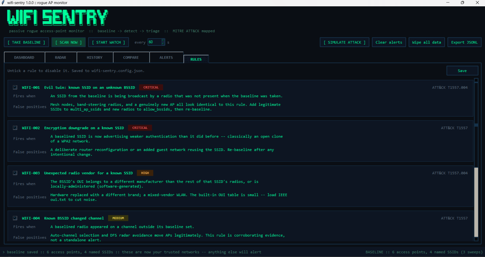
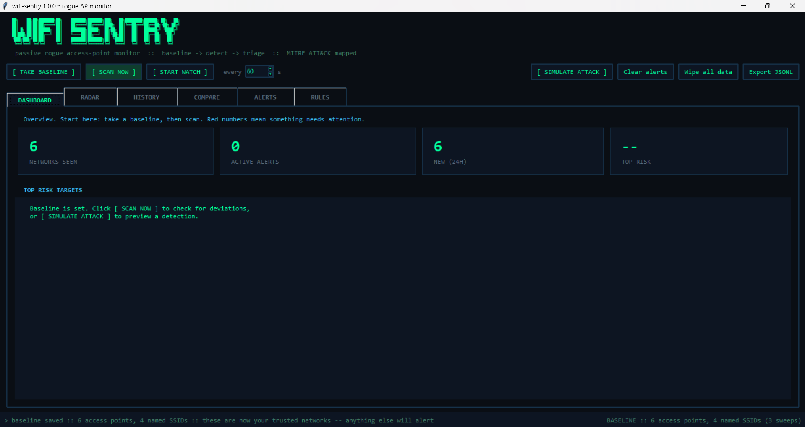
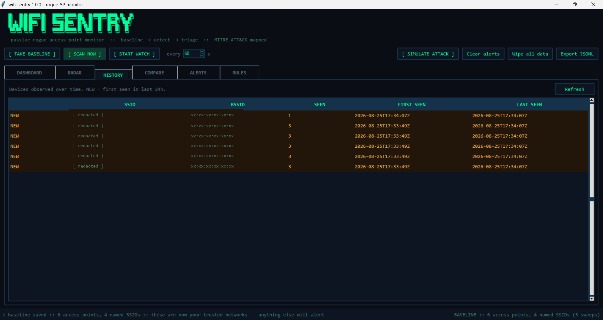
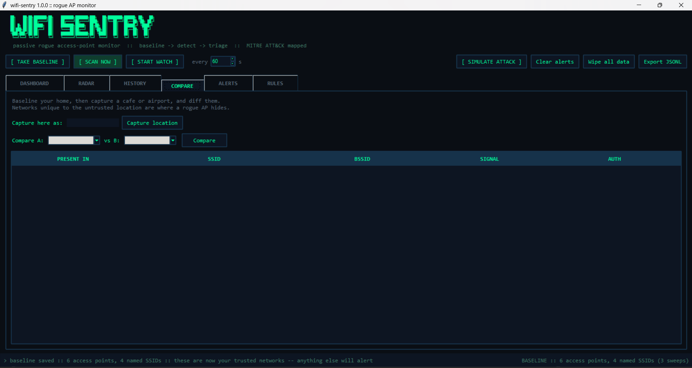
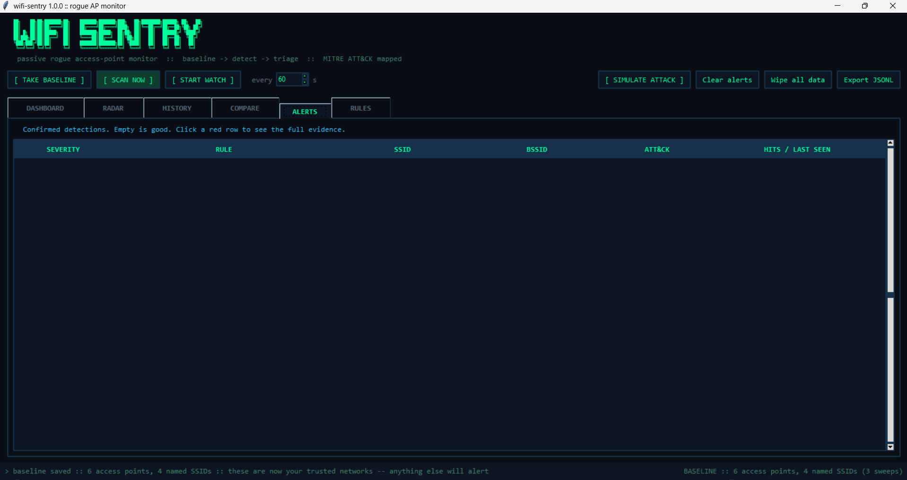

<div align="center">



**A rogue access point monitor for Windows that works without monitor mode.**

[](https://www.python.org/)
[](requirements.txt)
[](tests/)
[](#limitations)
[](#detection-rules)
[](LICENSE)

</div>

---

> **The SSID is a label anyone can copy in five seconds. The BSSID is the
> radio's MAC address.**
>
> An attacker can clone your network name trivially — but the moment they do,
> they broadcast it from a MAC that was never there before, usually a different
> vendor, often a locally-administered address no manufacturer ever assigned.

That asymmetry is the entire project. `wifi-sentry` is a **detection** tool, not
a scanner: listing nearby networks is the easy 10% every tutorial stops at;
deciding which one is *wrong* is the part worth building.

**Passive only** — never transmits, never deauthenticates, never captures
traffic. It reads the beacon metadata Windows already collects, so it needs no
Npcap and no monitor-mode adapter.



---

## The adversary's dilemma

An evil twin only works if victims connect to it *instead of* the real AP. That
requirement is not free — it forces the attacker into observable behaviour.

| To succeed, the attacker must… | Which forces… | Caught by |
|---|---|---|
| Broadcast your SSID | A BSSID never in your baseline | **WIFI-001** `critical` |
| Let victims connect without your PSK | Dropping WPA2/WPA3 to Open | **WIFI-002** `critical` |
| Run the AP in software (`hostapd`) | A locally-administered MAC | **WIFI-003** `high` |
| Out-shout the real AP | RSSI far above that BSSID's normal range | **WIFI-005** `medium` |
| Answer every probe it hears (KARMA) | One radio serving unrelated SSIDs | **WIFI-007** `high` |
| Occupy a clear channel | A known BSSID off its baseline channel | **WIFI-004** `medium` |
| Drown out the real network | A burst of never-seen SSIDs | **WIFI-006** `high` |

They can defeat any *one* of these. Defeating all seven at once, while staying
attractive enough for a client to pick, is the hard part — which is why
corroboration matters more than any single alert.

---

## Quick start

Python 3.10+, **zero dependencies**.

```powershell
git clone https://github.com/jaylalkiya/Wifi-Sentry.git
cd Wifi-Sentry
```

Double-click **`START.bat`** for the desktop UI, or:

```powershell
python -m wifisentry baseline    # learn normal (somewhere you trust)
python -m wifisentry scan        # check for deviations
python -m wifisentry watch --interval 60 --jsonl events.jsonl
```

`scan` exits **2** on high/critical findings, so Task Scheduler can act on it.

### See it catch something, right now

You can't screenshot an evil twin on demand — so `--replay` parses saved netsh
captures instead of touching the radio:

```powershell
python -m wifisentry --db demo.db --replay tests\fixtures\netsh_baseline.txt baseline
python -m wifisentry --db demo.db --replay tests\fixtures\netsh_attack.txt scan
```

```
[CRITICAL] WIFI-001 Evil twin: known SSID on an unknown BSSID
    SSID 'TrustedNet' is being broadcast by 02:11:22:33:44:55
    (Locally-administered/randomized), which was not in the baseline
    ATT&CK T1557.004 (Adversary-in-the-Middle: Evil Twin)

[CRITICAL] WIFI-002 Encryption downgrade on a known SSID
    SSID 'TrustedNet' on 02:11:22:33:44:55 now advertises 'Open' but was
    baselined as 'WPA2-Personal'
    ATT&CK T1557 (Adversary-in-the-Middle)

[HIGH] WIFI-007 One BSSID broadcasting multiple SSIDs
    b8:27:eb:99:88:77 (Raspberry Pi Foundation) is broadcasting 2 different
    SSIDs: ['Free_Airport_WiFi', 'Starbucks']
    ATT&CK T1557.004 (Adversary-in-the-Middle: Evil Twin)
```

Three independent rules corroborate the same rogue AP. **One signal is a guess;
three agreeing is a finding.**

---

## Detection rules

| ID | Rule | Fires when | Severity | ATT&CK |
|----|------|-----------|----------|--------|
| **WIFI-001** | Evil twin | A baselined SSID is broadcast by a radio absent at baseline | `critical` | T1557.004 |
| **WIFI-002** | Encryption downgrade | A baselined SSID now advertises weaker auth | `critical` | T1557 |
| **WIFI-003** | Unexpected radio vendor | The OUI differs from that SSID's other radios, or is locally-administered | `high` | T1557.004 |
| **WIFI-004** | Channel change | A baselined radio appears off its baseline channels | `medium` | T1557 |
| **WIFI-005** | Signal anomaly | A baselined radio is far louder or quieter than ever before | `medium` | T1557.004 |
| **WIFI-006** | Beacon flood | One sweep introduces implausibly many new SSIDs | `high` | T1498 |
| **WIFI-007** | Multi-SSID radio | A single radio answers to unrelated SSIDs | `high` | T1557.004 |

<details>
<summary><b>Why 003 and 007 are the interesting ones</b></summary>

<br>

**WIFI-003.** IEEE reserves bit 1 of a MAC's first octet for addresses *not*
assigned by a manufacturer. Real APs ship globally-unique addresses; `hostapd`,
Windows Hosted Network, and randomizing clients often do not. A
locally-administered BSSID claiming to be your corporate SSID is close to a
smoking gun — which is why that case escalates to `critical`.

**WIFI-007.** Legitimate multi-SSID APs give each network its own BSSID (usually
by incrementing the MAC). One radio answering to several *unrelated* SSIDs is the
signature of a KARMA-style responder saying "yes" to every probe it hears.

</details>

---

## How a beacon becomes an alert



Rules never touch netsh and never touch SQLite. They are **pure functions** of
`(observations, baseline, config, oui)` returning `Event` objects — which is why
all seven are testable without a radio, a database, or a rogue AP.

---

## Triage: what should I look at first?

Detection says *something* is wrong. Triage says **where to start**.

- **Risk score (0–100)** — additive and transparent; always ships the factors
  that built it, because an unexplained score is the fastest way to get a tool
  ignored.
- **Device fingerprint** — router, phone hotspot, SBC, IoT camera, printer. A
  beacon named "router" that fingerprints as "phone hotspot" is the evil-twin
  shape, surfaced even when no rule fires.
- **Proximity** — a coarse bucket (IN THE ROOM → DISTANT), deliberately not
  false-precision metres. An evil twin must out-shout the real AP, so *"closer
  than your router"* is strong corroboration.
- **History / location compare** — diffs two snapshots **by BSSID**, never by
  SSID, or an evil twin would hide under "shared".

```powershell
python -m wifisentry history --new --days 7   # devices new this week
python -m wifisentry snapshot home
python -m wifisentry compare home cafe        # what's different / suspicious
```

<details>
<summary><b>Screenshots</b> — six tabs, all identifiers redacted by the app itself</summary>

<br>

The UI ships a redaction mode, so screenshots and demos never leak real network
identifiers.

**RULES** — every rule states what fires it *and* its known false positives:


**DASHBOARD** — counts, top risk targets, baseline status:


**HISTORY** — every device ever seen, with first/last seen and sighting counts:


**COMPARE** — networks unique to the untrusted location are where a rogue hides:


**ALERTS** — confirmed detections, worst first. Empty is good:


Tkinter, so still no dependencies. Scans run on a worker thread and report back
through a queue, so the window stays responsive — and because `sqlite3`
connections cannot cross threads, each worker opens its own `Store` against the
same file.

</details>

---

## Tuning, output, commands

<details>
<summary><b>False positive tuning</b> — a rule that can't be tuned gets muted, and then detects nothing</summary>

<br>

```powershell
python -m wifisentry init-config     # writes wifi-sentry.config.json
```

| Knob | What it solves |
|------|----------------|
| `ignore_ssids` | Neighbours' networks you don't own. |
| `allow_bssids` | A radio confirmed legitimate — a mesh node you added yourself. |
| `multi_ap_ssids` | Mesh/enterprise SSIDs that legitimately grow radios. **Downgrades** WIFI-001 to `low` rather than hiding it, so the analyst still sees the change but nobody gets paged. |
| `signal_delta_db` | How far RSSI must move before WIFI-005 fires. 12 dB ≈ "moved rooms". |
| `beacon_flood_threshold` | New SSIDs per sweep before WIFI-006 fires. Raise it if you commute. |
| `disabled_rules` | Last resort. Prefer the allowlists. |

Three noise controls are built in rather than configured:

1. **Multi-sweep baselining.** 3 sweeps by default, recording a signal *range*,
   not a point. RSSI swings several dB between sweeps; a single-sweep baseline
   makes WIFI-005 scream on day two.
2. **Alert deduplication.** Keyed on `(rule, SSID, BSSID)` — deliberately
   excluding timestamp, signal, and channel. A rogue left powered on updates
   `hit_count` instead of producing a fresh wall of alerts every 60 seconds.
3. **Pre-rule filtering.** Allowlists are applied once, before any rule runs, so
   no individual rule has to remember to check.

</details>

<details>
<summary><b>SIEM output</b> — one JSON object per line</summary>

<br>

`--jsonl` writes the format every log shipper (Filebeat, Fluent Bit, Vector,
Splunk UF) ingests without configuration:

```json
{"bssid":"02:11:22:33:44:55","rule_id":"WIFI-001","severity":"critical","ssid":"TrustedNet","technique":"T1557.004","technique_name":"Adversary-in-the-Middle: Evil Twin","message":"SSID 'TrustedNet' is being broadcast by 02:11:22:33:44:55 ...","details":{"locally_administered":true,"signal_dbm":-51,"vendor":"Locally-administered/randomized"},"timestamp":"2026-08-25T09:00:43Z"}
```

Field names follow the ECS-ish shape most SIEMs expect: `rule_id`, `severity`,
`technique`, `ssid`/`bssid` as entities, and a `details` bag for rule-specific
evidence.

</details>

<details>
<summary><b>All commands and flags</b></summary>

<br>

| Command | What it does |
|---------|--------------|
| `baseline` | Sample the air N times, store what normal looks like. `--sweeps`, `--delay`, `--force`. |
| `scan` | One sweep, evaluate enabled rules, print and optionally append JSONL. |
| `watch` | `scan` on a loop. `--interval`. |
| `alerts` | Recorded alert state with first/last seen and hit counts. `--clear`. |
| `rules` | Print the catalogue, rationale, false positives, ATT&CK coverage. |
| `init-config` | Write a default tuning config. |
| `history` | Devices seen over time. `--days N`, `--new`. |
| `snapshot NAME` | Capture the current location. `--list`. |
| `compare A B` | Diff two snapshots; flag networks unique to B. |
| `gui` | Open the Tkinter desktop interface. |
| `capture FILE` | Save raw netsh output for fixtures and offline debugging. |

Global flags: `--db`, `--config`, `--interface`, `--oui-file`, `--replay`.

For full vendor coverage, point at IEEE's registry:

```powershell
curl -o oui.txt https://standards-oui.ieee.org/oui/oui.txt
python -m wifisentry --oui-file oui.txt scan
```

</details>

<details>
<summary><b>Architecture and tests</b></summary>

<br>

```
wifisentry/
  scanner.py      WlanScan sweep + netsh invocation and parsing
  models.py       Observation, Event, signal conversion
  oui.py          MAC vendor lookup, locally-administered detection
  baseline.py     multi-sweep aggregation
  detections.py   the 7 rules + engine
  config.py       tuning knobs and allowlists
  store.py        SQLite schema and access
  emit.py         console and JSONL output
  cli.py          argparse command surface
  analyze.py      risk + fingerprint + proximity, combined per AP
  distance.py     signal -> proximity estimate
  fingerprint.py  device-type inference
  risk.py         transparent 0-100 risk score
  compare.py      location snapshot diff
  gui.py          Tkinter desktop UI (threaded, queue-driven, 6 tabs)
tests/            99 tests, stdlib unittest, no radio required
```

The parser is deliberately **the only OS-specific module** — a Linux collector
emitting the same `Observation` objects would drop into the rest of the pipeline
unchanged.

```powershell
python -m unittest discover -s tests -v
```

99 tests: netsh parsing (hidden SSIDs, multi-BSSID SSIDs, malformed input), MAC
normalization, every rule firing *and* staying quiet, each tuning knob changing
the outcome, deduplication, config round-tripping, the full CLI via `--replay`,
and GUI rendering against real data. The one that matters most:

```python
def test_rescanning_the_baseline_is_silent(self):
    scan = load("netsh_baseline.txt")
    engine = DetectionEngine(make_baseline([scan]), Config(), OuiLookup())
    self.assertEqual(engine.run(scan), [])
```

**A detection tool that alerts on normal traffic is worse than no detection
tool, because people switch it off.**

</details>

---

## Limitations

Stated up front, because knowing what your tool *cannot* see is half of
detection engineering.

- **No monitor mode.** Deauth floods, probe-request harvesting, and client-side
  attacks are invisible here. Those need Linux plus a capable adapter.
- **Windows only.** `netsh` is the collector.
- **Windows throttles scanning, so the tool forces a sweep.** When connected and
  idle, Windows stops sweeping and `netsh` returns a cached list — often only
  the network you're attached to. wifi-sentry calls `WlanScan` (wlanapi.dll via
  ctypes) first and waits 4s. On this developer's machine that took a scan from
  1 visible network to 13. If it fails, it falls back rather than erroring.
- **English-locale field labels.** netsh localizes output; the parser degrades
  to fewer fields on other locales rather than crashing.
- **Signal is approximate.** Windows reports 0–100% quality; dBm is derived
  linearly. Monotonic, which is all WIFI-005 needs, but not a measurement.
- **WIFI-005 assumes a fixed location.** Disable it on a laptop that roams.

---

## Scope and ethics

This tool observes broadcast beacon frames — the same information your phone
uses to populate its WiFi list. It transmits nothing, associates with nothing,
captures no traffic.

That boundary is deliberate. Deauthentication, handshake capture, and cracking
are a different project with different legal exposure, and they are **offensive
work, not detection work.**

Baseline somewhere you control. Alerts are only meaningful against a baseline of
a network you actually know.

---

<div align="center">

**[MIT licensed](LICENSE)** · Built by [@jaylalkiya](https://github.com/jaylalkiya)

</div>
